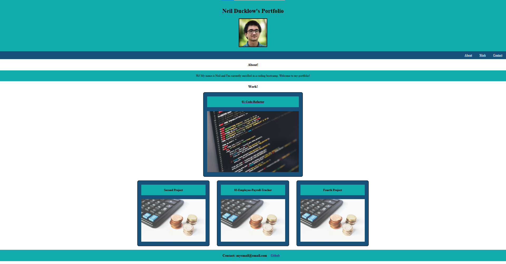

# 02-Advanced CSS: Portfolio

## Screenshot and Link

[Link to Application](https://nducklow.github.io/02-Portfolio/)

## Overview
Using advanced CSS techniques, we learned how to more effectively use CSS to make websites more appealing to the end user.

### CSS

In this project I learned how to use different features of CSS of to make my portfolio more organized and easier to view by an end user. I learned the importance of using css selectors to specifcially target elements on my portfolio that I wanted to change. Without knowing this tool, this project would have been almost impossible, as the CSS would have no idea what element I wanted to change. I also learned the importance of using the flexbox property to help better position my elements on the page. Using the @media rule was also very helpful in making my webpage more responsive to a variety of screen sizes.